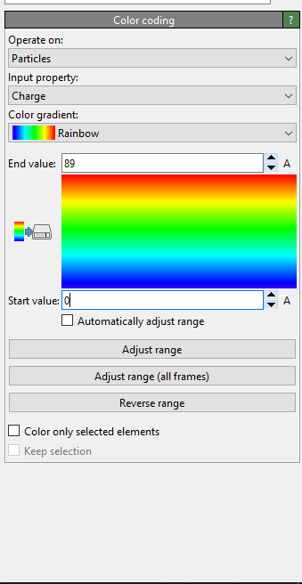

# SIA-TP2

## Librerias Necesarias

Para poder ejecutar el motor es necesario poseer las siguientes librerias de python:

- matplotlib
- numpy

En caso de no tenerlas instaladas, se pueden ejecutar los siguientes comandos para hacerlo:

`pip install matplotlib`

`pip install numpy`

## Ejecución del proyecto

### Ejercicio 1

#### Ejecutar programa

Debe estar en carpeta EJ1/src:

```bash
    python main.py
```

#### Administrar parámetros

Para administrar parámetros hay un archivo config.json,donde podemos gestionar tres parámetros diferentes de nuestro programa.

```json
{
    "operation": "and",
    "learning_rate": 0.001,
    "num_epochs": 100
}
```

Donde la operación puede ser "and" o "xor".
Los otros dos parámetros learning rate y numero de épocas pueden tener cualquier número que consideremos oportuno.

### Ejercicio 2

#### Software Necesario
Para poder observar la evolución del vector W durante el entrenamiento es necesario del siguiente software:
 - ovito: https://www.ovito.org/windows-downloads/

#### Ejecución del proyecto

Para ejecutar el ejercicio 2, uno debe moverse al directorio llamado "EJ2" por medio del siguiente comando mientras se esta ubicado en la carpeta raíz del proyecto:

```bash
    cd EJ2
```

Para correr el ejercicio se utiliza el siguiente comando ubicado dentro del directorio para correr el ejercicio:

```bash
    python main.py
```

Es posible cambiar los parámetros de entrenamiento del perceptrón por medio del csv llamado "parameters.csv" ubicado en el directorio raíz del ejercico. Algunos de los parámetros que es posible editar son:

- etha
- beta
- iterations: cantidad de iteraciones/epocas
- training_percentage: porcentage utilizado para el entrenamiento del perceptrón
- activationType: este parámetro modifica la función de activación a utilizar en el perceptrón. Este parámetro posee valores fijos (`linear`, `tanh`, `logistic`)
- trainingType: este parámetro modifica la forma en la que se selecciona el "batch" para entrenar el preceptrón. Este parámetro posee valores fijos (`epoca`, `random`)

El ultimo parámetro "graph_option" determina el gráfico que se quiere generar. El parámetro puede tomar los siguientes valores:
- `1`:  genera el gráfico de error cuadratico medio en función del porcentaje de entrenamiento. Para este gráfico, el parámetro "training_percentage" y "activationType" del csv no serán utilizados. El gráfico generado utilizan las sigmoideas(tanh y logistic) como función de activación
- `2`: genera el gráfico de error cuadratico medio en función de las epocas durante el entrenamiento
- `3`: genera un archivo .xyz con la evolución del vector W en función de las iteraciones durante el entrenamiento. De esta manera es posible ver como el modelo evoluciona para inferir un modelo en base a los parametros utilizados. El modelo sera exportado como "model.xyz"

los graficos de las opciones 1 y 2, seran guardadas en el directorio plots de la carpeta raiz del ejercicio.

#### Instrucciones de uso de ovito
Una vez generado el archivo .xyz, se debe abrir este archivo por medio del software ovito. Una vez abierto el archivo, se abrirá un menú en el cual es posible mapear las columnas del archivo. Las columnas deben estar mapeadas de la siguiente forma:
 - columna 1: position (eje x)
 - columna 2: position (eje y)
 - columna 3: position (eje z)
 - columna 4: charge
 
 
 
 Por ultimo, debemos agregar la modificación "color coding"
 
 
 
 y ajustar el rango de color entre 0 y 89 para asi poder ver la evolución por medio del cambio de color de las particulas( las coordenadas representan E1, E2, E3 mientras que el color representa el resultado del modelo evaluado en sus respectivos inputs)
 
 

### Ejercicio 3

#### Ejecución del proyecto
Para ejecutar el perceptrón multicapa, primero hay que posicionarse en la carpeta "EJ3":

```bash
    cd EJ3
```

De ser necesario, se instalan los requerimientos:

```bash
    pip install -r requirements.txt
```

Luego, dependiendo del ejercicio, se definen las configuraciones y se ejecuta el archivo python correspondiente:

**3A: Ejercicio XOR.**
```json
{
    "normalize": 1,
    "hidden_activation": "relu",
    "output_activation": "sigmoid",

    "input_file": "./input_files/a.txt",
    "training_set_ratio": 100,

    "num_features": 2,
    "num_outputs": 1,

    "apply_bias": 0,
    "learning_rate": 0.001,

    "num_epochs": 5000,
    
    "use_mini_batches": 0,
    "mini_batch_size": 1,

    "hidden_layers": {
        "use_num": 0,
        "num_layers": 5,
        "max_dim": 20,
        "__or": "",
        "layer_dims": [10]
    },

    "optimizer": {
        "method": "gd",
        "momentum_alpha": 0.9,
        "adam": {
            "beta1": 0.9,
            "beta2": 0.999,
            "epsilon": 1e-8
        }
    },

    "adaptive_etha": {
        "after": 0,
        "a": 0.01,
        "b": 0.0001
    }
}
```
```bash
    python a.py
```

**3B: Ejercicio Paridad de Mapa de Bits.**
```json
{
    "normalize": 0,
    "hidden_activation": "relu",
    "output_activation": "sigmoid",

    "input_file": "./input_files/b.txt",
    "training_set_ratio": 100,

    "num_features": 35,
    "num_outputs": 1,

    "apply_bias": 0,
    "learning_rate": 0.00001,

    "num_epochs": 100000,
    
    "use_mini_batches": 0,
    "mini_batch_size": 1,

    "hidden_layers": {
        "use_num": 0,
        "num_layers": 5,
        "max_dim": 20,
        "__or": "",
        "layer_dims": [10]
    },

    "optimizer": {
        "method": "momentum",
        "momentum_alpha": 0.9,
        "adam": {
            "beta1": 0.9,
            "beta2": 0.999,
            "epsilon": 1e-8
        }
    },

    "adaptive_etha": {
        "after": 1,
        "a": 0.01,
        "b": 0.0001
    }
}
```
```bash
    python b.py
```
**3C: Ejercicio Identificar Número por su Mapa de Bits.**
```json
{
    "normalize": 0,
    "hidden_activation": "relu",
    "output_activation": "sigmoid",

    "input_file": "./input_files/c.txt",
    "training_set_ratio": 100,

    "num_features": 35,
    "num_outputs": 10,

    "apply_bias": 0,
    "learning_rate": 0.0001,

    "num_epochs": 50000,
    
    "use_mini_batches": 0,
    "mini_batch_size": 1,

    "hidden_layers": {
        "use_num": 0,
        "num_layers": 5,
        "max_dim": 20,
        "__or": "",
        "layer_dims": [10]
    },

    "optimizer": {
        "method": "adam",
        "momentum_alpha": 0.9,
        "adam": {
            "beta1": 0.9,
            "beta2": 0.999,
            "epsilon": 1e-8
        }
    },

    "adaptive_etha": {
        "after": 5,
        "a": 0.01,
        "b": 0.0001
    }
}
```
```bash
    python c.py
```
